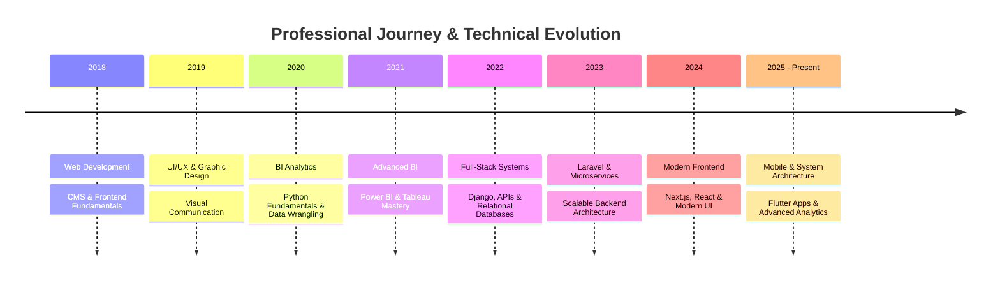

<div align="center">

<!-- Hero Banner -->


<!-- Typing SVG -->


<br>

<!-- Social & Badges -->
[](https://www.linkedin.com/in/stephen-muambi-021aa065/)
[](https://twitter.com/Muambi_Ke)
[](mailto:stevemuambi@gmail.com)
[](https://github.com/stevescilar)

<br>

[](https://github.com/stevescilar)
[](https://github.com/stevescilar)
[](https://wakatime.com/@563ecbb7-89c4-4563-82c1-258e14191d74)

</div>

---

## 🚀 About Me

```python
class MuambiDev:
    def __init__(self):
        self.name = "Stephen Muambi"
        self.alias = "Muambi.Dev"
        self.role = "Data Analyst | BI Specialist | Full-Stack & Mobile Developer"
        self.location = "Nairobi, Kenya"
        self.current_focus = [
            "Laravel & RESTful API Architectures",
            "Flutter Cross-Platform Mobile Apps",
            "Power BI & Python Data Analytics"
        ]
        self.passion = "Bridging the gap between raw data, backend intelligence, and intuitive UI"

    def get_stack(self):
        return {
            "mobile": ["Flutter", "Dart"],
            "web_backend": ["Laravel (PHP)", "Python", "FastAPI", "Django"],
            "frontend": ["Next.js", "React", "TypeScript", "Tailwind CSS"],
            "analytics_bi": ["Power BI", "Tableau", "SQL", "Pandas", "NumPy"],
            "infrastructure": ["Docker", "AWS", "MySQL", "PostgreSQL", "Git"]
        }

    def say_hello(self):
        print("Thanks for stopping by! Let's build something impactful together! 🚀")

me = MuambiDev()
me.say_hello()
```

> *"A good traveler has no fixed plans and is not intent on arriving."* — Lao Tzu

---

## 🏗️ Architecture & Ecosystem


```mermaid
flowchart LR
    subgraph Data["📊 Data & BI Layer"]
        D1["Python / Pandas"]
        D2["SQL Analytics"]
        D3["Power BI / Tableau"]
    end

    subgraph Backend["⚙️ Backend & API Layer"]
        B1["Laravel (PHP)"]
        B2["RESTful APIs & Auth"]
        B3["MySQL / PostgreSQL"]
    end

    subgraph Client["🚀 Client Experience"]
        C1["Flutter Mobile Apps"]
        C2["Next.js & React Web"]
    end

    Data -->|"Actionable Insights"| Backend
    Backend -->|"Secure APIs & Services"| Client

    style Data fill:#0e2a38,stroke:#00D9FF,stroke-width:2px,color:#fff
    style Backend fill:#381313,stroke:#FF2D20,stroke-width:2px,color:#fff
    style Client fill:#142d42,stroke:#007ACC,stroke-width:2px,color:#fff
```

- 🔭 **Engineering Full-Stack & Mobile:** Developing production Laravel backends and sleek Flutter mobile applications.
- 📊 **Data-Driven Intelligence:** Architecting automated ETL workflows and interactive executive BI dashboards.
- 🎨 **User-Centric Design:** Combining functional backend architecture with responsive, polished interfaces.
- ⚡ **Continuous Mastery:** Exploring AI/ML integration, scalable cloud microservices, and high-throughput systems.

---

## 💻 Tech Stack & Toolkit

<div align="center">

### Languages & Frameworks


### Data, BI & Analytics


### Databases & Cloud / DevOps


</div>

---

## 🌟 Featured Projects

<div align="center">

<table width="100%">
<tr>
<td width="50%" valign="top">
<h3 align="center">💰 The Money Circle</h3>
<div align="center">  
<a href="https://github.com/stevescilar/TheMoneyCircle" target="_blank">
  
  
  
</a>
<br><br>
<p><strong>Comprehensive Financial Management Platform</strong> for cooperative savings groups, financial goal tracking, automated member reports, and category budgeting.</p>
<p><a href="https://github.com/stevescilar/TheMoneyCircle"><b>View Repository ➜</b></a></p>
</div>
</td>
<td width="50%" valign="top">
<h3 align="center">📱 The Money Circle App</h3>
<div align="center">
<a href="https://github.com/stevescilar/TheMoneyCircle-TMCapp" target="_blank">
  
  
  
</a>
<br><br>
<p><strong>Cross-Platform Mobile Client</strong> delivering seamless real-time transaction tracking, member dashboards, and savings analytics with smooth native performance.</p>
<p><a href="https://github.com/stevescilar/TheMoneyCircle-TMCapp"><b>View Repository ➜</b></a></p>
</div>
</td>
</tr>

<tr>
<td width="50%" valign="top">
<h3 align="center">📊 Enterprise BI & Analytics</h3>
<div align="center">
<a href="https://github.com/stevescilar" target="_blank">
  
  
  
</a>
<br><br>
<p><strong>Interactive Business Intelligence Dashboards</strong> and automated ETL data pipelines turning raw operational databases into real-time KPI metrics and executive insights.</p>
<p><a href="https://github.com/stevescilar"><b>Explore Analytics ➜</b></a></p>
</div>
</td>
<td width="50%" valign="top">
<h3 align="center">⚡ High-Performance REST API</h3>
<div align="center">
<a href="https://github.com/stevescilar" target="_blank">
  
  
  
</a>
<br><br>
<p><strong>Secure, Scalable Backend Services</strong> built with RESTful principles, robust rate throttling, JWT/Sanctum authentication, and comprehensive test coverage.</p>
<p><a href="https://github.com/stevescilar"><b>Explore Architecture ➜</b></a></p>
</div>
</td>
</tr>
</table>

</div>

---

## 📊 GitHub Analytics & Activity

<div align="center">

<table border="0">
  <tr>
    <td align="center">
      <a href="https://github.com/stevescilar">
        
      </a>
    </td>
    <td align="center">
      <a href="https://github.com/stevescilar">
        
      </a>
    </td>
  </tr>
  <tr>
    <td align="center">
      <a href="https://github.com/stevescilar">
        
      </a>
    </td>
    <td align="center">
      <a href="https://github.com/stevescilar">
        
      </a>
    </td>
  </tr>
</table>

</div>

---

## 🎓 Professional Journey


```mermaid
timeline
    title Professional Journey & Technical Evolution
    2018 : Web Development : CMS & Frontend Fundamentals
    2019 : UI/UX & Graphic Design : Visual Communication
    2020 : BI Analytics : Python Fundamentals & Data Wrangling
    2021 : Advanced BI : Power BI & Tableau Mastery
    2022 : Full-Stack Systems : Django, APIs & Relational Databases
    2023 : Laravel & Microservices : Scalable Backend Architecture
    2024 : Modern Frontend : Next.js, React & Modern UI
    2025 - Present : Mobile & System Architecture : Flutter Apps & Advanced Analytics
```

---

<details>
<summary><b>🎯 Click to Expand: 2026 AI / Machine Learning Roadmap & Goals</b></summary>
<br>

### 🎯 Machine Learning Learning Path

| Phase | Focus Area | Key Topics | Status | Target |
|:---:|:---:|:---:|:---:|:---:|
| **Phase 1** | ML Foundations | Linear Algebra, Statistics, Python for Data | 🔜 In Progress | Q1 2026 |
| **Phase 2** | Supervised Learning | Classification, Regression, Decision Trees | 📅 Upcoming | Q2 2026 |
| **Phase 3** | Deep Learning | Neural Networks, CNNs, RNNs | 📅 Upcoming | Q2-Q3 2026 |
| **Phase 4** | Computer Vision | Image Classification, Object Detection | 📅 Upcoming | Q3 2026 |
| **Phase 5** | NLP & LLMs | Text Processing, Transformers, Prompt Engineering | 📅 Upcoming | Q3-Q4 2026 |
| **Phase 6** | MLOps | Model Deployment, Monitoring, API Pipelines | 📅 Upcoming | Q4 2026 |

#### 🎯 Target Projects:
1. **ML Foundations:** Housing Price Predictor & Iris Multi-class Classification
2. **Supervised Learning:** Credit Card Fraud Detection & Customer Churn Prediction
3. **Deep Learning:** Handwritten Digit Recognition (MNIST) & Neural Image Classifier
4. **Computer Vision:** Real-time Object Detection & License Plate Recognition
5. **NLP:** Sentiment Analysis Engine & AI Chatbot
6. **End-to-End:** Deploying ML-powered analytics endpoints inside Laravel applications

</details>

---

<div align="center">

### 💼 What I Bring to the Table

| 📊 Analytics & BI | ⚙️ Backend & API | 📱 Web & Mobile |
|:---:|:---:|:---:|
| Executive KPI Dashboards | Scalable Laravel Architectures | Cross-Platform Flutter Apps |
| Automated ETL Data Pipelines | RESTful & JWT API Services | Next.js & React Responsive UI |
| SQL Optimization & Modeling | Relational Schema Design | Intuitive UI/UX Design |
| Statistical Insights & Reporting | Docker & Cloud Deployments | Performance Optimization |

<br>

### 💬 Let's Connect & Collaborate!

[](https://www.linkedin.com/in/stephen-muambi-021aa065/)
[](https://twitter.com/Muambi_Ke)
[](mailto:stevemuambi@gmail.com)

<br>


**Made with ❤️ and lots of ☕ in Nairobi, Kenya**

</div>
