<div align="center">

# 👨‍💻 Stephen (Muambi) Sila

### Data Analyst | BI Specialist | Full-Stack Developer


[](https://github.com/stevescilar)
[](https://github.com/stevescilar)
[](https://wakatime.com/@563ecbb7-89c4-4563-82c1-258e14191d74)

</div>

---

## 🚀 About Me

```python
class TechGuy:
    def __init__(self):
        self.name = "Stephen Muambi"
        self.alias = "SamuraiCod3r"
        self.role = "BI Analyst | Data Analyst | Full-Stack Developer"
        self.location = "Nairobi, Kenya"
        self.current_focus = ["Laravel Projects", "Next.js", "Data Analytics"]
        self.passion = "Transforming raw data into actionable insights"
        
    def get_skills(self):
        return {
            "languages": ["Python", "PHP", "JavaScript", "SQL", "R"],
            "analytics": ["Power BI", "Tableau", "Excel", "Google Analytics"],
            "frameworks": ["Laravel", "Django", "Flask", "React", "Next.js"],
            "databases": ["PostgreSQL", "MySQL", "MongoDB"],
            "tools": ["Git", "Docker", "AWS", "Jupyter", "Composer"]
        }
    
    def say_hello(self):
        print("Thanks for stopping by! Let's build something amazing together! 🚀")

me = TechGuy()
me.say_hello()
```

> *"A good traveler has no fixed plans and is not intent on arriving."* — Lao Tzu

---

## 🎯 Current Focus

```mermaid
graph LR
    A[🔥 Laravel Projects] --> B[Backend APIs]
    A --> C[Full-Stack Apps]
    B --> D[🚀 Deployment]
    C --> D
    E[📊 Data Analytics] --> F[BI Dashboards]
    G[⚛️ Next.js] --> H[Modern Web Apps]
    F --> D
    H --> D
    style A fill:#FF2D20,stroke:#fff,color:#fff
    style E fill:#00D9FF,stroke:#fff,color:#000
    style G fill:#000,stroke:#00D9FF,color:#fff
```



- 🔭 Building **Laravel applications** with modern architecture
- 🌱 Mastering **Next.js** for cutting-edge web experiences
- 💡 Creating **data-driven solutions** that impact businesses
- 🎨 Combining **analytics, development & design**
- 📊 Exploring advanced **data visualization techniques**

---

## 💻 Tech Stack

<div align="center">

### Languages & Frameworks


### Data & Analytics


### Tools & Platforms


</div>

---

## 🌟 Featured Projects

<div align="center">

<table>
<tr>
<td width="50%">
<h3 align="center">Laravel E-Commerce Platform</h3>
<div align="center">  
<a href="https://github.com/stevescilar" target="_blank">

</a>
<br><br>
<p><strong>Full-stack e-commerce solution</strong> with payment integration, inventory management, and admin dashboard.</p>
</div>
</td>
<td width="50%">
<h3 align="center">Data Analytics Dashboard</h3>
<div align="center">
<a href="https://github.com/stevescilar" target="_blank">

</a>
<br><br>
<p><strong>Interactive BI dashboard</strong> for real-time business metrics visualization and reporting.</p>
</div>
</td>
</tr>

<tr>
<td width="50%">
<h3 align="center">Next.js Portfolio</h3>
<div align="center">
<a href="https://github.com/stevescilar" target="_blank">

</a>
<br><br>
<p><strong>Modern portfolio website</strong> with server-side rendering, animations, and contact forms.</p>
</div>
</td>
<td width="50%">
<h3 align="center">Laravel API Service</h3>
<div align="center">
<a href="https://github.com/stevescilar" target="_blank">

</a>
<br><br>
<p><strong>RESTful API</strong> with authentication, rate limiting, and comprehensive documentation.</p>
</div>
</td>
</tr>
</table>

</div>

---

## 📊 GitHub Analytics

<div align="center">

<a href="https://github.com/stevescilar">
  
  
</a>

<a href="https://github.com/stevescilar">
  
</a>

<a href="https://github.com/stevescilar">
  
</a>

</div>

---

## 🏆 GitHub Trophies

<div align="center">

<a href="https://github.com/stevescilar">
  
</a>

</div>

---

## 📈 Contribution Graph

<div align="center">

[](https://github.com/stevescilar)

</div>

---

## 🛠️ Skills Progress

<div align="center">

```text
Laravel           ████████████████████░   95%
Python            ███████████████████░░   90%
Data Analytics    ███████████████████░░   90%
Next.js           ████████████████░░░░░   80%
React             ████████████████░░░░░   80%
SQL               ███████████████████░░   85%
Docker            ███████████░░░░░░░░░░   60%
AWS               ██████████░░░░░░░░░░░   50%
```

</div>

---

## 🎓 My Journey


---

## 🎯 2025-2026 Goals

- [x] Master Laravel advanced patterns & architecture
- [x] Build 5 production-ready full-stack applications
- [ ] Contribute to 10 open-source projects
- [ ] Write 20 technical blog posts
- [ ] Achieve 1000+ GitHub contributions
- [ ] Launch a SaaS product

---

## 💼 What I Bring to the Table

<div align="center">

| 📊 Analytics | 💻 Development | 🎨 Design |
|:---:|:---:|:---:|
| Data Visualization | Full-Stack Development | UI/UX Design |
| Business Intelligence | Python Automation | Graphic Design |
| Statistical Analysis | API Development | Brand Identity |
| Predictive Modeling | Database Management | Visual Storytelling |
| KPI Dashboards | Laravel/Next.js | Responsive Design |

</div>

---

## 🌐 Let's Connect!

<div align="center">

[](https://www.linkedin.com/in/stephen-muambi-021aa065/)
[](https://twitter.com/Muambi_Ke)
[](mailto:stevemuambi@gmail.com)
[](https://github.com/stevescilar)

</div>

---

<div align="center">

### 💬 Ask Me About

**Laravel** • **Web Development** • **Data Analytics** • **Graphic Design** • **Python** • **BI Tools** • **Next.js**

---

### ⚡ Fun Fact

*I find coding fascinating and believe the best insights come from data that tells a story!*

---

</div>

## 📚 Currently Learning

```mermaid
graph TD
    A[🎯 Laravel API Mastery] --> B[RESTful Design Patterns]
    A --> C[API Authentication]
    A --> D[Rate Limiting & Throttling]
    B --> E[📖 Best Practices]
    C --> E
    D --> E
    E --> F[🚀 Production Ready APIs]
    
    style A fill:#FF2D20,stroke:#fff,color:#fff
    style F fill:#00D9FF,stroke:#fff,color:#000
```

<div align="center">



### Current Focus Areas:


**Building:** Scalable, secure, and well-documented Laravel APIs with modern authentication patterns

</div>

---

## 🗺️ Learning Roadmap

<div align="center">


### 🎯 Machine Learning Journey

| Phase | Focus Area | Key Topics | Status | Target |
|:---:|:---:|:---:|:---:|:---:|
| **Phase 1** | ML Foundations | Linear Algebra, Statistics, Python | 🔜 Planning | Q1 2026 |
| **Phase 2** | Supervised Learning | Classification, Regression, Decision Trees | 📅 Upcoming | Q2 2026 |
| **Phase 3** | Deep Learning | Neural Networks, CNNs, RNNs | 📅 Upcoming | Q2-Q3 2026|
| **Phase 4** | Computer Vision | Image Classification, Object Detection | 📅 Upcoming | Q3 2026 |
| **Phase 5** | NLP & LLMs | Text Processing, Transformers, GPT | 📅 Upcoming | Q3-Q4 2026 |
| **Phase 6** | MLOps | Model Deployment, Monitoring, Scaling | 📅 Upcoming | Q4 2026 |

#### 🎓 Detailed Learning Path:

<table>
<tr>
<td width="33%">
<h4 align="center">🔢 Foundations</h4>
<p align="center">
• Linear Algebra<br>
• Probability & Statistics<br>
• Calculus Basics<br>
• NumPy & Pandas<br>
• Data Visualization<br>
• Feature Engineering
</p>
</td>
<td width="33%">
<h4 align="center">🤖 Core ML</h4>
<p align="center">
• Scikit-learn Mastery<br>
• Supervised Learning<br>
• Unsupervised Learning<br>
• Ensemble Methods<br>
• Model Selection<br>
• Hyperparameter Tuning
</p>
</td>
<td width="33%">
<h4 align="center">🧠 Deep Learning</h4>
<p align="center">
• TensorFlow & PyTorch<br>
• Neural Networks<br>
• CNNs & Image Recognition<br>
• RNNs & Time Series<br>
• GANs & Autoencoders<br>
• Transfer Learning
</p>
</td>
</tr>
<tr>
<td width="33%">
<h4 align="center">👁️ Computer Vision</h4>
<p align="center">
• Image Classification<br>
• Object Detection (YOLO)<br>
• Semantic Segmentation<br>
• Face Recognition<br>
• OCR Systems<br>
• Video Analysis
</p>
</td>
<td width="33%">
<h4 align="center">💬 NLP & LLMs</h4>
<p align="center">
• Text Preprocessing<br>
• Sentiment Analysis<br>
• Named Entity Recognition<br>
• Transformers & BERT<br>
• GPT Fine-tuning<br>
• Chatbot Development
</p>
</td>
<td width="33%">
<h4 align="center">🚀 MLOps & Production</h4>
<p align="center">
• Model Deployment<br>
• Docker for ML<br>
• API Integration<br>
• Model Monitoring<br>
• A/B Testing<br>
• Cloud ML (AWS/GCP)
</p>
</td>
</tr>
</table>

#### 🛠️ Tools & Technologies to Master:

**Core ML & Data Science**


**Deep Learning Frameworks**


**NLP & Transformers**


**MLOps & Deployment**


**Development Tools**


#### 🎯 Project Ideas for Each Phase:

1. **ML Foundations**: Housing Price Predictor, Iris Classification
2. **Supervised Learning**: Credit Card Fraud Detection, Customer Churn Prediction
3. **Deep Learning**: Handwritten Digit Recognition (MNIST), Image Classifier
4. **Computer Vision**: Face Mask Detector, License Plate Recognition
5. **NLP**: Sentiment Analysis Tool, AI Chatbot, Text Summarizer
6. **End-to-End**: Deploy a Full ML-powered Laravel Application

</div>

---

<div align="center">


**Made with ❤️ and lots of ☕**

</div>
